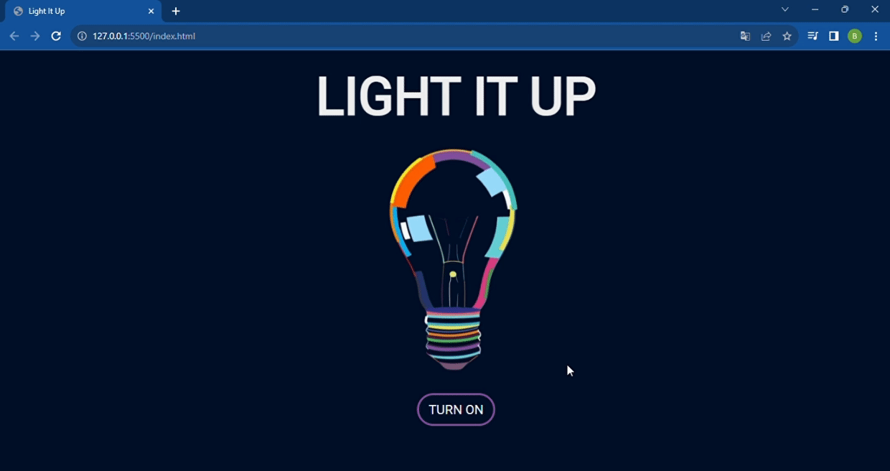
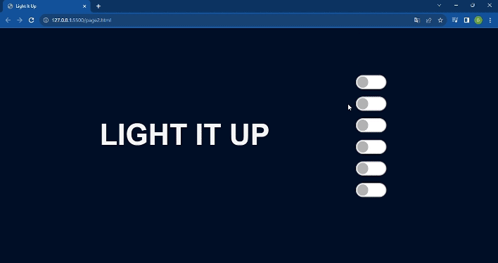

## 💡Light It Up💡

    
    Light It Up is an interactive layout that can brighten your day 
    with an intuitive and user-friendly interface full of fun animations. 

## Stacks used

  
  
  
  
  

 
 
## Preview

 
 

    

 

 

